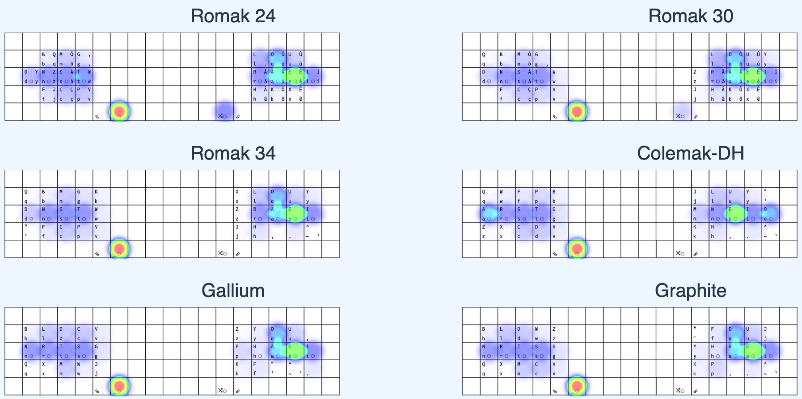

# The Romak Keyboard Layout

**Romak** is a keyboard layout built for Portuguese and English users, with a goal to enhance hand alternation, minimize finger movement, reduce single-finger bigrams, and decrease reliance on the pinky and central columns.

Romak is inspired mostly by [BEAKL](https://deskthority.net/wiki/BEAKL) and [Engram](https://engram.dev/), but resembles some modern keyboard layouts, like [Gallium](https://github.com/GalileoBlues/Gallium), [Graphite](https://github.com/rdavison/graphite-layout), [Apt](https://github.com/Apsu/apt), [Sturdy](https://oxey.dev/sturdy/), [Semimak](https://semilin.github.io/blog/2021/semimak.html), [Canary](https://github.com/Apsu/Canary) and [Recurva](https://github.com/GalileoBlues/Recurva), but was not inspired by any of them (I did not know about them when Romak was designed).

## Romak 34

This is a variation of Romak that can be used by anyone with a 34 keys columnar staggered keyboard, in the common format 3x5+2.

```
  Q  B  M  G  K    X  L  O  U  Y
  D  N  S  T  W    Z  R  A  E  I
  /  F  C  P  V    J  H  ,  .  ;
```

## Romak 30

This is a variation of Romak that can be used with 30 keys, in the format 23332+2, with boards like the Hummingbird and Rommana.
In this variation, all alphas remain in the base layer, and common symbols like comma and dot are moved to combos, like HK for comma and KX for dot.

```
  Q  B  M  G  W    Z  L  O  U  Y
  D  N  S  T  V    J  R  A  E  I
     F  C  P          H  K  X  
```

## Romak 24

This is the default Romak layout, designed for the uncommon format 1333+2, in which there are no center columns and only one key per pinky. A secondary alpha layer is necessary to place the missing alphas. Common accented letters, in Portuguese, are also available in this secondary alpha layer.

Alpha 1 layer:

```
     B  M  G          L  O  U   
  D  N  S  T          R  A  E  I 
     F  C  P          H  ,  .   
           Rp Sp   A2 Sf
```
```
Rp = Repeat Last Key
Sp = Space
Sf = One Shot Shift
A2 = One Shot Alpha 2
```

Alpha 2 layer:

```
     Q  Qu K          Ô  Ó  Ú
  Y  Z  X  W          À  Á  É  Í
     J  Ç  V          ~  Â  Ê
           '  _    _  _
```

## Combos for alphas, common symbols and n-grams:

Alpha 1 combos:
```
NS = Q
MG = K
ST = W
CP = V
LO = X
RA = Z
H, = J
AE = Y
```

Alpha 2 combos:
```
ZX = (
JÇ = _
QuK = "
XW = '
ÇV = ?
ÔÓ = :
ÀÁ = -
~Â = !
ÁÉ = )
ÂÊ = _
```

## Magic Romak

This is a version of Romak 24 that uses a Magic Key to improve the typing experience, reducing SFBs and consecutive activations of the secondary alpha layer.

### Smart Shift

In this version, a new feature is introduced, the Smart Shift behavior. With this feature, the One Shot Shift key will not act as shift when typed mid word, but as something else instead. In this case, it can be either a Repeat Key or a Magic Key.

This will allow the extisting Repeat Key to be merged within the existing One Shot Shift key, on the right side, which will allow for better hand alternation when used as Repeat Key, since the most repeatable alphas are placed on the left side.

It will also free up the left thumb to accomodate another Smart Shift key, but in this case it will act as a Magic Key when tapped mid word. It will also allow for better hand alternation when used before letters placed in the right hand.

Alpha 1 layer:

```
     B  M  G          L  O  U   
  D  N  S  T          R  A  E  I 
     F  C  P          H  ,  .   
           *  Sp   A2 ®
```
```
* = One Shot Shift / Magic Key
Sp = Space
® = One Shot Shift / Repeat Key
A2 = One Shot Alpha 2
```

Alpha 2 layer:

```
     Q  Qu K          Ô  Ó  Ú
  Y  Z  X  W          À  Á  É  Í
     J  Ç  V          ~  Â  Ê
           '  _    _  _
```

### Magic Key

And this is how this Magic Key will behaves:

| Combination  | Output  | Example | Reason |
|---|---|---|---|
| u*  | ue | blue | reduce SFBs
| x*  | xc | exceed | reduce SFBs
| d*  | dy | dye | reduce SFBs
| e*  | ei | sei | avoid uncomfortable ring to pinky sequences 
| n*  | nd | and | avoid uncomfortable ring to pinky sequences
| i*  | backspace I' | I'm | smart apostrophe
| j*  | já | já | reduce consecutive activation of Alpha 2 
| í*  | ív | possível | reduce activation of Alpha 2 
| á*  | áv | agradável | reduce activation of Alpha 2 
| a* | backspace ã | não | reduce activation of Alpha 2 
| o* | backspace õ | põe | reduce activation of Alpha 2 
| anything else *  | repeat | follow | reduce SFBs 

## Performance Analysis

A quick comparison between these 3 variations of Romak and some popular modern layouts can be seen below. These tests included both Portuguese and English in the text corpus.




A more detailed performance analysis for the Romak 34 and other modern layouts can be found [here](analysis.md).

## Use Case

If you want to see this layout in use, check my [Keyboards](https://github.com/rafaelromao/keyboards) repository.
