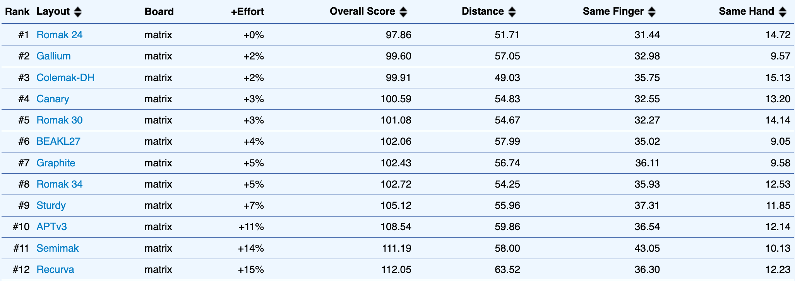
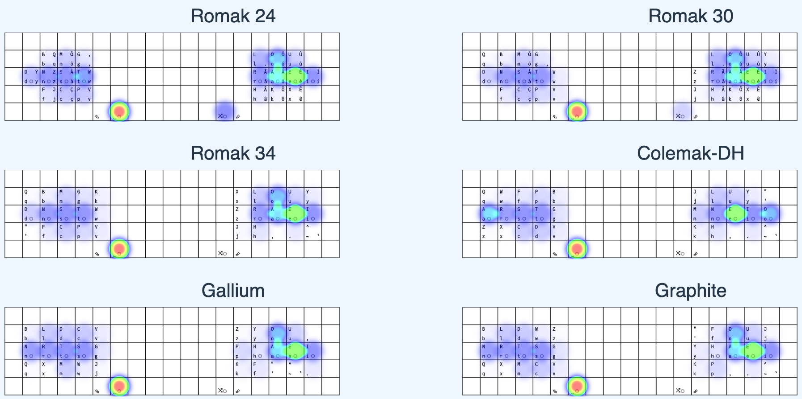

# The Romak Keyboard Layout

**Romak** is a keyboard layout built for Portuguese and English users, with a goal to enhance hand alternation, minimize finger movement, reduce single-finger bigrams, and decrease reliance on the pinky and central columns.

Romak is inspired mostly by [BEAKL](https://deskthority.net/wiki/BEAKL) and [Engram](https://engram.dev/), but resembles some modern keyboard layouts, like [Gallium](https://github.com/GalileoBlues/Gallium), [Graphite](https://github.com/rdavison/graphite-layout), [Apt](https://github.com/Apsu/apt), [Sturdy](https://oxey.dev/sturdy/), [Semimak](https://semilin.github.io/blog/2021/semimak.html), [Canary](https://github.com/Apsu/Canary) and [Recurva](https://github.com/GalileoBlues/Recurva), but was not inspired by any of them (I did not know about them when Romak was designed).

## Romak 34

This is a variation of Romak that can be used by anyone with a 34 keys columnar staggered keyboard, in the common format 3x5+2.

```
  Q  B  M  G  K    X  L  O  U  Y
  D  N  S  T  W    Z  R  A  E  I
  '  F  C  P  V    J  H  ,  .  ;
```

## Romak 30

This is a variation of Romak that can be used with 30 keys, in the format 23332+2, with boards like the Hummingbird and Rommana. In this variation, dot and comma must go to combos or a layer.

```
  Q  B  M  G  W    Z  L  O  U  Y
  D  N  S  T  V    J  R  A  E  I
     F  C  P          H  K  X  
```

## Romak 24

This is the default Romak layout, designed for the uncommon format 1333+2, in which there are no center columns and only one key per pinky. A secondary alpha layer is necessary to place missing alphas and puntuation. Common accented letters, in Portuguese, are also available in this secondary alpha layer, along with some combos for common n-grams like `ão`, `õe`, `ção` and `ções`.

Alpha 1 layer:

```
     B  M  G          L  O  U   
  D  N  S  T          R  A  E  I 
     F  C  P          H  K  X   
           Rp Sp   A2 SF
```
```
Rp = Repeat Last Key
Sp = Space
Sf = One Shot Shift
A2 = One Shot Alpha 2 layer
```

Alpha 2 layer:

```
     Q  Qu ,          .  Ó  Ú
  Y  Z  À  W          Ã  Á  É  Í
     J  Ç  V          Â  Ô  Ê
           '  Sp   A2 SF
```

## Combos for alphas, common symbols and n-grams:


Alpha 1 combos:
```
MG = ,
NS = Q
ST = W
CP = V

LO = .
RA = Z
H, = J
AE = Y
```

Alpha 2 combos:
```
ZÀ = (
JÇ = _
Qu, = #
ÀW = )
ÇV = ?

.Ó = :
ÃÁ = -
ÂÔ = !
ÁÉ = ão
ÔÊ = õe

ÃÁÉ = ção
ÂÔÊ = ções
```

## Performance Analysis

A quick comparison between these 3 variations of Romak and some popular modern layouts can be seen below. These tests included both Portuguese and English in the text corpus.




A more detailed performance analysis for the Romak 34 and other modern layouts can be found [here](analysis.md).

## Use Case

If you want to see this layout in use, check my [Keyboards](https://github.com/rafaelromao/keyboards) repository.
