# The Romak Keyboard Layout

## Romak Performance Analysis

**Romak** is a keyboard layout built for Portuguese and English users, with a goal to enhance hand alternation, minimize finger movement, reduce single-finger bigrams, and decrease reliance on the pinky and central columns.

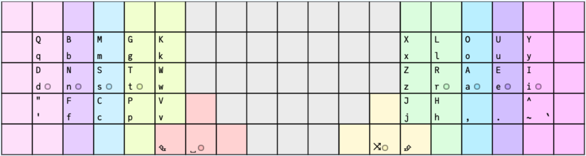

## KLA Next
[KLA Next](https://klanext.keyboard-design.com/) was used to compare Romak with Colemak-DH and some other layouts, using the Universal Declaration of Human Rights as text corpus, combining [Portuguese and English](analysis/corpus.txt).
### General Performance

Romak has 2 alpha layers, with an oneshot key used to quickly alternate between them. This is not supported by KLA Next, so some adjustments were necessary:
- Use AltGr instead of the oneshot key, so the tool considers the AltGr held to access the secondary alpha layer.
- All layouts involved in the comparison have the same thumb configuration.
- Symbols and numbers were excluded from the analysis for all considered layouts.
- The files with this configuration can be found [here](analysis/).
- With this configuration, Romak scores second, slightly better than most other layouts.

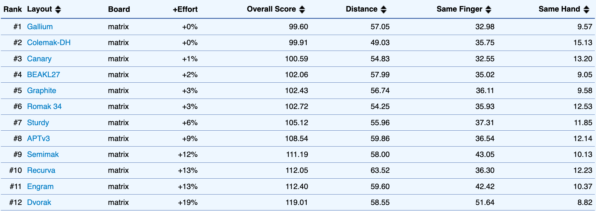

When comparing using only English in the text corpus, Graphite jumps to the top, followed by Colemak-DH, Canary, Romak and Sturdy, these last ones almost tied.
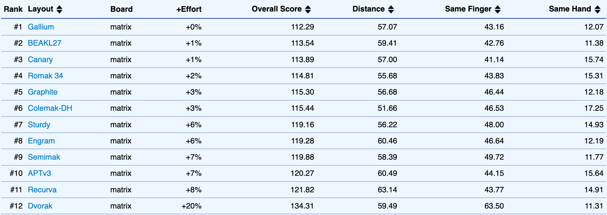

When comparing using only Portuguese, Canary extends its leading margin, and Colemak-DH goes down, among the last positions.
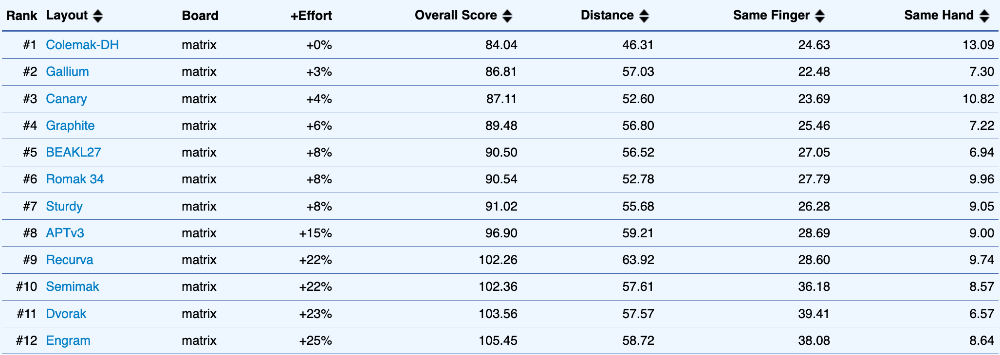

### Heatmaps

The heatmaps below also consider both Portuguese and English in the text corpus.

These heatmaps show that Romak puts more load on middle and ring fingers and less load on index and pinky fingers, when compared to Colemak-DH, and has a better effort distribution than most other layouts.

  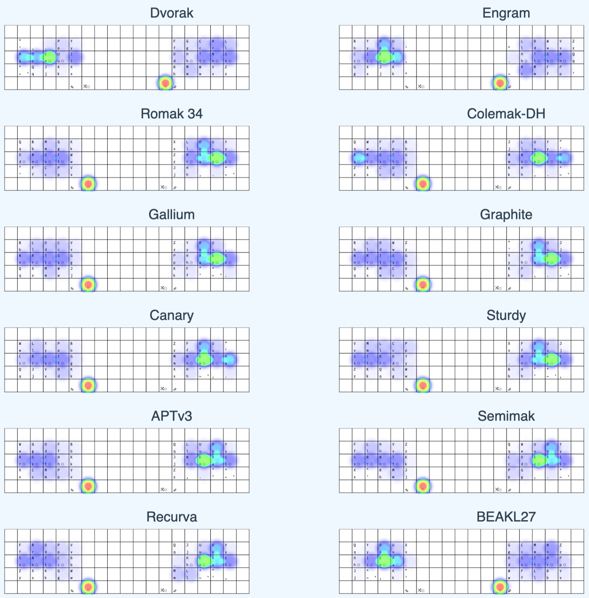

### Finger Usage
In Romak, fingers in the left hand will take less load than the equivalent fingers in the right hand.

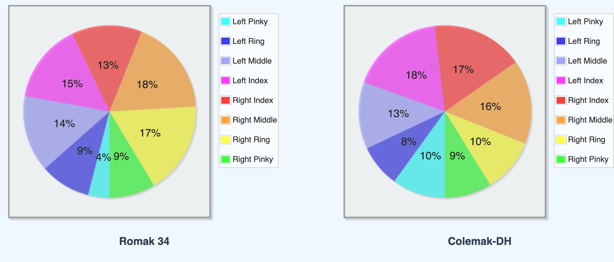

### Colemak mod-DH analysis tool
The [Colemak mod-DH analysis tool](https://colemakmods.github.io/mod-dh/analyze.html) was also used to compare Romak against Colemak-DH.
- English text corpus only.
- Consider the 34 key version of Romak.

  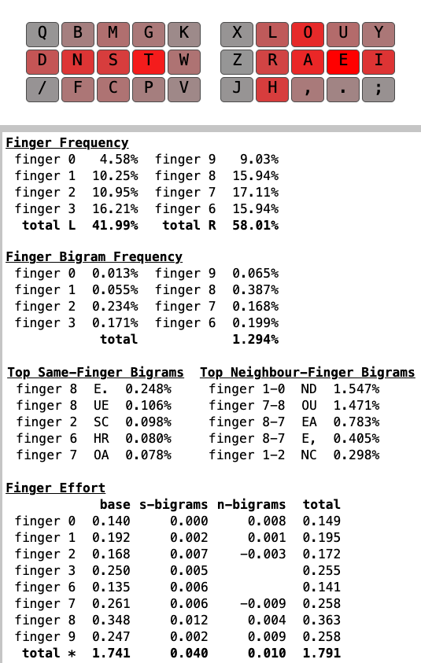
  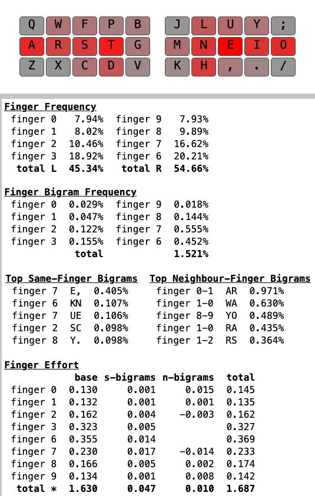

### Keysolve
The [Keysolve analyzer](https://clemenpine.github.io/keysolve-web/) was also used to compare Romak against Colemak-DH.
- English text corpus only.
- Consider the 34 key version of Romak.

  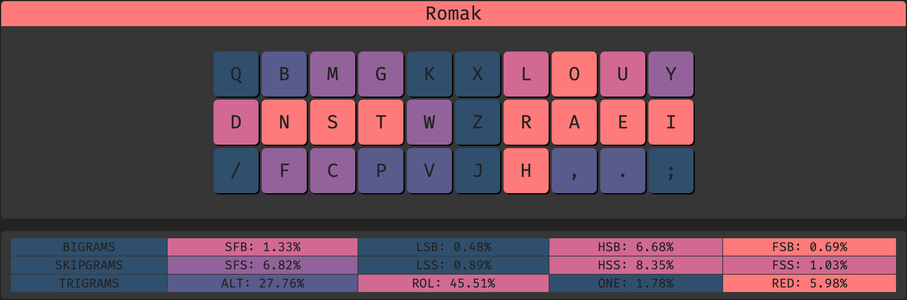
  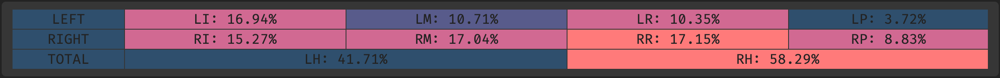

  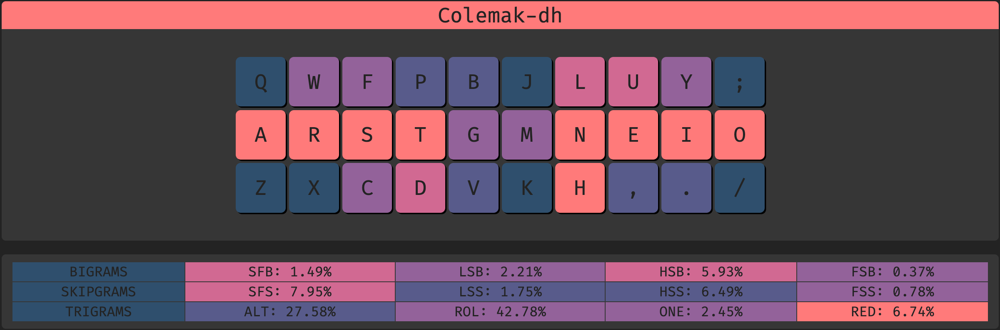
  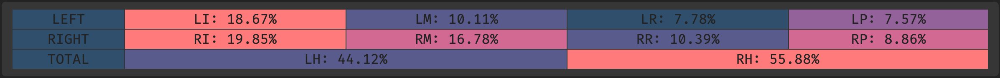

