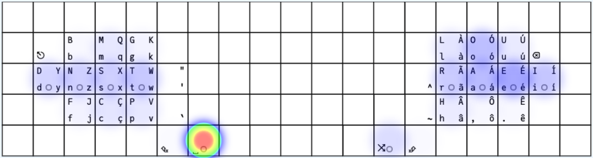
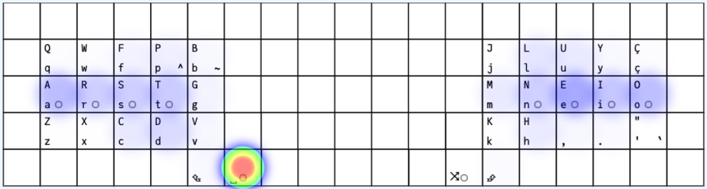

# The Romak Keyboard Layout

## Romak Performance Analysis

**Romak** is a keyboard layout designed for Portuguese and English, with a goal of good hand alternation, reduced finger travel and single finger bigrams, and less use of the pinky and central columns.

## KLA Next
[KLA Next](https://klanext.keyboard-design.com/) was used to compare Romak with Colemak-DH and some other layouts, using the Universal Declaration of Human Rights as text corpus, combining [Portuguese and English](analysis/corpus.txt).
### General Performance

Romak has 2 alpha layers, with an oneshot key used to quickly alternate between them. This is not supported by KLA Next, so some adjustments were necessary:
- Use AltGr instead of the oneshot key, so the tool considers the AltGr held to access the secondary alpha layer.
- All layouts involved in the comparison have the same thumb configuration.
- Symbols and numbers were excluded from the analysis for all considered layouts.
- The files with this configuration can be found [here](analysis/).
- With this configuration, Romak scores slightly better than the others.

### Heatmaps

Heatmaps show that Romak puts more load on middle and ring fingers and less load on index and pinky fingers, when compared to Colemak-DH.

  
   

### Finger Usage
In Romak, fingers in the left hand will take less load than the equivalent fingers in the right hand.

### Colemak mod-DH analysis tool
The [Colemak mod-DH analysis tool](https://colemakmods.github.io/mod-dh/analyze.html) was also used to compare Romak against Colemak-DH.
- English text corpus only.
- Consider the 34 key version of Romak, with q, x, k and y in the base layer.

  
  

### Keysolve
The [Keysolve analyzer](https://clemenpine.github.io/keysolve-web/) was also used to compare Romak against Colemak-DH.
- English text corpus only.
- Consider the 34 key version of Romak, with q, x, k and y in the base layer.

  
  

