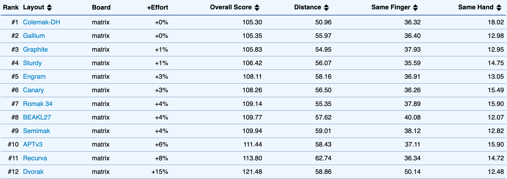
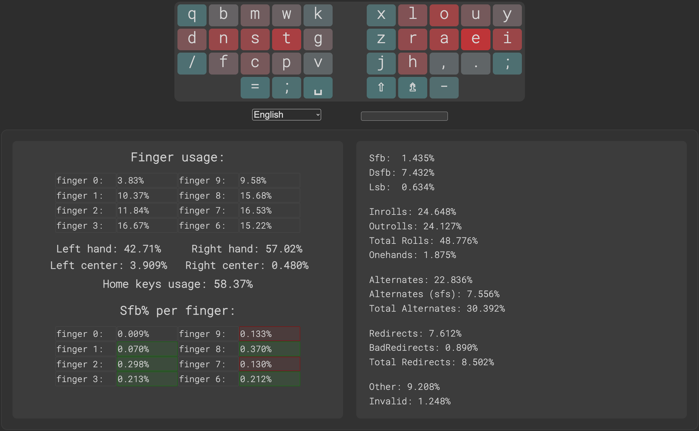
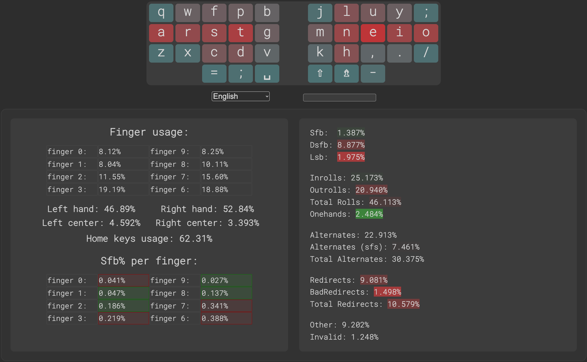

# The Romak Keyboard Layout

## Romak Performance Analysis

**Romak** is a keyboard layout built for Portuguese and English users, with a goal to enhance hand alternation, minimize finger movement, reduce single-finger bigrams, and decrease reliance on the pinky and central columns.

## KLA Next
[KLA Next](https://klanext.keyboard-design.com/) was used to compare Romak with some other modern layouts, using a 1MB text corpus (for each language) generated by ChatGPT 4 using the 180 most common words in work emails and work chat messages, for both [Portuguese and English](analysis/corpus.txt).

### Results

Some adjustments were necessary to focus the comparison on the alphas only, but including dead keys for accented letters:
- `'` and `"` were present in all layouts, so a single spare key was left, usually filled with `:` and `;`. These symbols were replaced by `~`, `^` and `` ` `` to give dead keys to all layouts. It will affect them differently, but was a fair way to include dead keys in all of them.
- Space is placed on the opposite side as vowels, for all layouts, to improve hand balance.
- Other than quotes, dead keys, comma and dot, all other symbols, and numbers, were excluded from the analysis, for all layouts.
- The files with this configuration can be found [here](analysis/).

And these are the results for this comparison. We can see that the best layouts alternate positions according to the text corpus, but without much difference in the extra effort percentage.

When using Portuguese and English in the text corpus:

When comparing using only English in the text corpus:

When comparing using only Portuguese:

When comparing using the text corpus *Chained English Bigrams 7 (1MB)*, from KLA:

### Heatmaps

The heatmaps below also consider both Portuguese and English in the text corpus.

Using the heatmaps, we can see that the finger effort is better distributed in Romak, Gallium and Graphite, giving more work to the stronger fingers, while Colemak-DH penalizes pinkies in favor of more use of the home row, which is one of the factors that puts it among the bests in the results. This strategy is questionable though, and one of the reason why layouts like Romak, Gallium and Graphite were created.

  

## Colemak mod-DH analysis tool
The [Colemak mod-DH analysis tool](https://colemakmods.github.io/mod-dh/analyze.html) was also used to compare Romak against Colemak-DH.
- English text corpus only.
- Consider the 34 key version of Romak.

  
  

## Keysolve
[Keysolve analyzer](https://clemenpine.github.io/keysolve-web/) was also used to compare Romak against Colemak-DH.
- English text corpus only.
- Consider the 34 key version of Romak.

  
  

  
  

## Oxey Playground
[Oxey Playgrond](https://oxey.dev/playground/index.html) was also used to compare Romak against Colemak-DH.
- English text corpus only.
- Consider the 34 key version of Romak.

  

  

