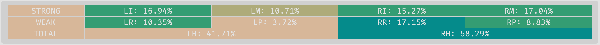
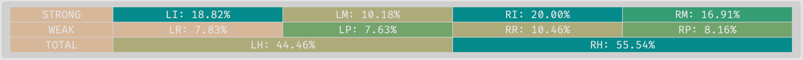
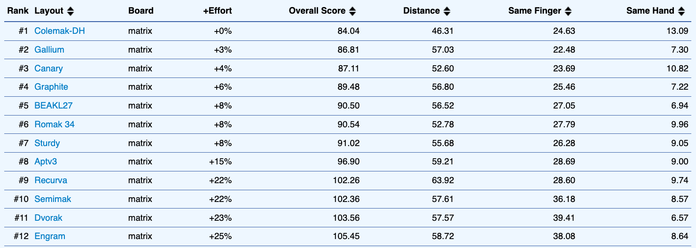

# Romak

**Romak** is a keyboard layout built for Portuguese and English users, with a goal to enhance hand alternation, minimize finger movement, reduce single-finger bigrams, and decrease reliance on the pinky and central columns.

Romak is inspired mostly by [BEAKL](https://deskthority.net/wiki/BEAKL) and [Engram](https://engram.dev/), but resembles some modern keyboard layouts, like [Gallium](https://github.com/GalileoBlues/Gallium), [Graphite](https://github.com/rdavison/graphite-layout), [Apt](https://github.com/Apsu/apt), [Sturdy](https://oxey.dev/sturdy/), [Semimak](https://semilin.github.io/blog/2021/semimak.html), [Canary](https://github.com/Apsu/Canary) and [Recurva](https://github.com/GalileoBlues/Recurva), but was not inspired by any of them (I did not know about them when Romak was designed).

## Romak Variants

The most relevant variant is Magic Romak. It contains only 24 keys and uses [Magic Keys](https://github.com/Ikcelaks/keyboard_layouts/blob/main/magic_sturdy/magic_sturdy.md) to improve the typing experience. But before, let's talk about the regular Romak variants.

### Romak 34

This is the standard variant of Romak, that can be used by anyone with a 34 keys columnar staggered keyboard, in the common format 3x5+2. A secondary alpha layer can be used to type accented vowels. This secondary alpha layer is a sticky layer, it means, it will be kept active until the next key is tapped, or until the timeout expires.

Alpha 1 layer:

```
  q  b  m  g  k    x  l  o  u  ;
  d  n  s  t  w    z  r  a  e  i
  y  f  c  p  v    j  h  ,  .  /
           ® ␣      ² ⇧
```

Alpha 2 layer:

```
        qu            ô  ó  ú
                      ã  á  é  í
        ç             õ  â  ê
           '  _    _  '
```
```
® = Repeat Last Key
␣ = Space
⇧ = One Shot Shift
² = One Shot Alpha 2
```

#### Ç Extension

There is an extension to the secondary alpha layer, which I call *Ç Extension*. It activates an one-shot layer just after `ç` is typed, to allow easy access to `ã`, `õ` and macros for `ão` and `ões`.

Ç Extension layer:

```
     _  _  _          _  _  _
  _  _  _  ão         ã  _  _  _
     _  _  ões        õ  _  _
           _  _    _  _
```

### Romak 24

This is the smallest variant of the Romak layout, designed for the uncommon format 1333+2, in which there are no center columns and only one key per pinky.

Alpha 1 layer:

```
     b  m  g          l  o  u   
  d  n  s  t          r  a  e  i 
     f  c  p          h  ,  .   
           ® ␣      ² ⇧
```

Alpha 2 layer:

```
     q  qu k          ô  ó  ú
  y  z  x  w          ã  á  é  í
     j  ç  v          õ  â  ê
           '  _    _  '
```
```
® = Repeat Last Key
␣ = Space
⇧ = One Shot Shift
² = One Shot Alpha 2
```

#### Combos:

Base layer combos are optional. They are available as a convenient alternative to the secondary alpha layer.

Alpha 1 combos:
```
ns = q
mg = k
st = w
cp = v
lo = x
ra = z
h, = j
ae = y
```
Secondary alpha layer combos complement its funcionalities.

Alpha 2 combos:
```
zx  = dead ^
jç  = dead ~
quk = dead "
xw  = dead '
çv  = dead `
ãá  = ?
õâ  = ! 
áé  = à
âê  = _
```

### Magic Romak

This is a variant of Romak 24 that uses [Magic Keys](https://github.com/Ikcelaks/keyboard_layouts/blob/main/magic_sturdy/magic_sturdy.md) to improve the typing experience.

Alpha 1 layer:

```
     b  m  g          l  o  u   
  d  n  s  t          r  a  e  i 
     f  c  p          *  ,  .   
           ® ␣      ² ⇧
```

Alpha 2 layer:

```
     q  qu k          ô  ó  ú
  y  z  x  w          ã  á  é  í
     j  ç  ^          õ  â  ê
           '  _    _  '
```
```
® = Repeat Last Key
␣ = Space
⇧ = One Shot Shift
² = One Shot Alpha 2
* = Magic Key
^ = Reversed Magic Key
```

#### Magic Key

The Magic Key will produce `h` by default and `v` after vowels.

This is how the **Magic Key** behaves:

| Previous Keys | Output  | 
|---|---|
| Vowels | v |
| &blank; | h |
| OS &#8679; | h |
| Anything Else | h |

#### Reversed Magic Key

The Reversed Magic Key does the opposite of the Magic Key, producing `v` by default and `h` after vowels..

This is how the **Reversed Magic Key** behaves:

| Previous Keys | Output  | 
|---|---|
| Vowels | h |
| &blank; | v |
| OS &#8679; | v |
| Anything Else | v |

#### Repeat Key

Usually the Repeat Key will simply repeat the last character, but in some cases an alternate repeat can be used.

This is how the **Repeat Key** behaves:

| Previous Key | Output  |
|---|---|
| v x j| OS Alpha 2 |
| á ó é ê | x |
| h | ões |
| a | h |
| y | d |
| í | e |
| qu | ê |
| ' | v |
| &#8679; i | ' |
| Anything Else | Repeat |

## Performance Analysis

### Keysolve

[Keysolve analyzer](https://galileoblues.github.io/keysolve-web/) was used to compare Romak against Colemak-DH.
- English text corpus only.
- Considering the 34 key version of Romak.

<p float="left">
  
  
</p>
<p float="right">
  
  
</p>

### Cyanophage

A similar analysis in the [Cyanophage analyzer](https://cyanophage.github.io/playground.html?layout=qbmgkxlou%2F%5Cdnstwzraei-yfcpvjh%2C.%3B%27%5E&mode=ergo&lan=english&thumb=r):

<p float="left">
  
</p>
<p float="right">
  
</p>

### KLA Next

[KLA Next](https://klanext.keyboard-design.com/) was also used to compare Romak with some other modern layouts, using a 1MB text corpus (for each language) generated by ChatGPT 4 using the 180 most common words in work emails and work chat messages, for both Portuguese and English.

#### Results

Some adjustments were necessary to focus the comparison on the alphas only:
- Accents and apostrophe were removed from all layouts, and `!` an `?` where included to fill the 2 available spots.
- Space is placed on the opposite side as vowels, for all layouts, to improve hand balance.
- Other than the basic punctuation, all other symbols, and numbers, were excluded from the analysis, for all layouts.

And these are the results for this comparison. We can see that the best layouts alternate positions according to the text corpus, but without much difference in the extra effort percentage.

When using Portuguese and English in the text corpus:


When comparing using only English:


When comparing using only Portuguese:


#### Heatmaps

The heatmaps below also consider both Portuguese and English in the text corpus.

Using the heatmaps, we can see that the finger effort is better distributed in Romak, Gallium and Graphite, giving more work to the stronger fingers, while Colemak-DH penalizes pinkies in favor of more use of the home row, which is one of the factors that puts it among the bests in the results. This strategy is questionable though, and one of the reason why layouts like Romak, Gallium and Graphite were created.

<p float="left">
  
</p>

## Implementation

If you want to see this layout in use, check my [Keyboards](https://github.com/rafaelromao/keyboards) repository.
