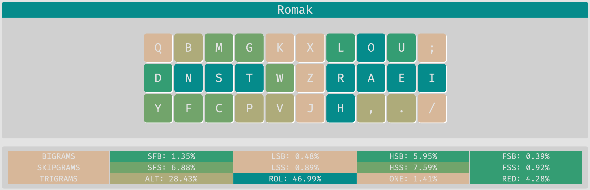
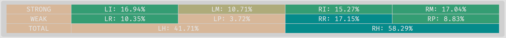
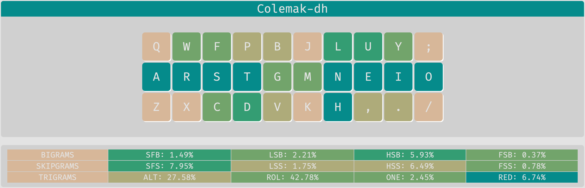
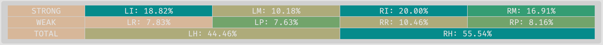
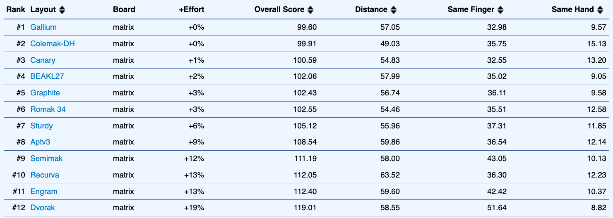
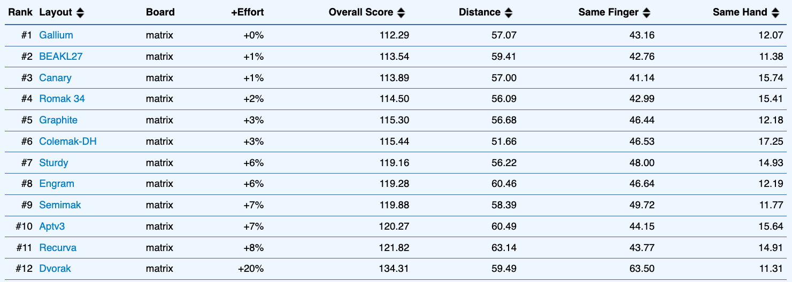
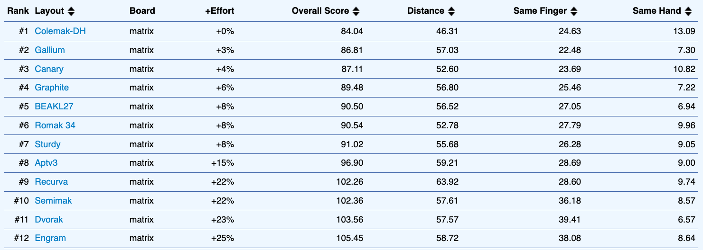
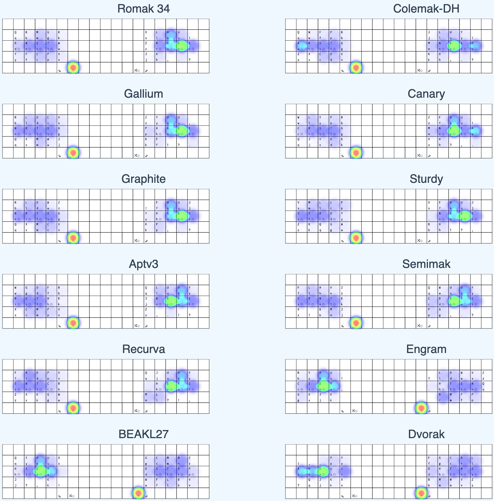

# Romak

**Romak** é um layout de teclado criado para usuários de português e inglês, com o objetivo de aprimorar a alternância das mãos, minimizar o movimento dos dedos, reduzir bigramas de um único dedo e diminuir a dependência do dedo mínimo e das colunas centrais.

Romak é inspirado principalmente no [BEAKL](https://deskthority.net/wiki/BEAKL) e no [Engram](https://engram.dev/), mas se assemelha a alguns layouts de teclado modernos, como [Gallium](https://github.com/GalileoBlues/Gallium), [Graphite](https://github.com/rdavison/graphite-layout), [Apt](https://github.com/Apsu/apt), [Sturdy](https://oxey.dev/sturdy/), [Semimak](https://semilin.github.io/blog/2021/semimak.html), [Canary](https://github.com/Apsu/Canary) e [Recurva](https://github.com/GalileoBlues/Recurva), mas não foi inspirado por nenhum deles (eu não os conhecia quando o Romak foi projetado).

## Variantes do Romak

A variante mais relevante é o Magic Romak. Ele contém apenas 24 teclas e usa [Teclas Mágicas](https://github.com/Ikcelaks/keyboard_layouts/blob/main/magic_sturdy/magic_sturdy.md) para melhorar a experiência de digitação. Mas antes, vamos falar sobre as variantes regulares do Romak.

### Romak 34

Esta é a variante padrão do Romak, que pode ser usada por qualquer pessoa com um teclado de colunas paralelas de 34 teclas, no formato comum 3x5+2. Uma camada de letras secundária pode ser usada para digitar vogais acentuadas. Essa camada de letras secundária é uma camada aderente, ou seja, ela se mantém atíva até que a próxima tecla seja apertada, ou até que o tempo limite se esgote.

Camada de Letras 1:

```
  q  b  m  g  k    x  l  o  u  ;
  d  n  s  t  w    z  r  a  e  i
  y  f  c  p  v    j  h  ,  .  /
           ® ␣      ² ⇧
```

Camada de Letras 2:

```
        qu            ô  ó  ú
                      ã  á  é  í
        ç             õ  â  ê
           '  _    _  '
```
```
® = Repetir Última Tecla
␣ = Espaço
⇧ = Shift Aderente
² = Camada de Letras 2 Aderente
```

#### Extensão do Ç

Existe uma extensão para a camada de letras secundária, que eu chamo de *Extensão do Ç*. Ela ativa uma camada aderente após `ç` ser digitado, para permitir acesso fácil a `ã`, `õ` e macros para `ão` e `ões`.

Camada da Extensão do Ç:

```
     _  _  _          _  _  _
  _  _  _  ão         ã  _  _  _
     _  _  ões        õ  _  _
           _  _    _  _
```

### Romak 24

Esta é a menor variante do layout Romak, projetada para o formato incomum 1333+2, no qual não há colunas centrais e apenas uma tecla por dedo mínimo.

Camada de Letras 1:

```
     b  m  g          l  o  u   
  d  n  s  t          r  a  e  i 
     f  c  p          h  ,  .   
           ® ␣      ² ⇧
```

Camada de Letras 2:

```
     q  qu k          ô  ó  ú
  y  z  x  w          ã  á  é  í
     j  ç  v          õ  â  ê
           '  _    _  '
```
```
® = Repetir Última Tecla
␣ = Espaço
⇧ = Shift Aderente
² = Camada de Letras 2 Aderente
```

#### Combos:

Os combos da camada base são opcionais. Eles estão disponíveis como uma alternativa conveniente à camada de alfas secundária.

Combos da Camada de Letras 1:
```
ns = q
mg = k
st = w
cp = v
lo = x
ra = z
h, = j
ae = y
```
Os combos da camada de alfas secundária complementam suas funcionalidades.

Combos da Camada Alfas 2:
```
zx  = dead ^
jç  = dead ~
quk = dead "
xw  = dead '
çv  = dead `
ãá  = ?
õâ  = ! 
áé  = à
âê  = _
```

### Magic Romak

Esta é uma variante do Romak 24 que usa [Teclas Mágicas](https://github.com/Ikcelaks/keyboard_layouts/blob/main/magic_sturdy/magic_sturdy.md) para melhorar a experiência de digitação.

Camada de Letras 1:

```
     b  m  g          l  o  u   
  d  n  s  t          r  a  e  i 
     f  c  p          *  ,  .   
           ® ␣      ² ⇧
```

Camada de Letras 2:

```
     q  qu k          ô  ó  ú
  y  z  x  w          ã  á  é  í
     j  ç  ^          õ  â  ê
           '  _    _  '
```
```
® = Repetir Última Tecla
␣ = Espaço
⇧ = Shift Aderente
² = Camada de Letras 2 Aderente
* = Tecla Mágica
^ = Tecla Mágica Invertida
```

#### Tecla Mágica

A Tecla Mágica produzirá `h` por padrão e `v` após vogais.

É assim que a **Tecla Mágica** se comporta:

| Teclas Anteriores | Saída  | 
|---|---|
| Vogais | v |
| &blank; | h |
| OS &#8679; | h |
| Qualquer Outra Coisa | h |

#### Tecla Mágica Invertida

A Tecla Mágica Invertida faz o oposto da Tecla Mágica, produzindo `v` por padrão e `h` após vogais.

É assim que a **Tecla Mágica Invertida** se comporta:

| Teclas Anteriores | Saída  | 
|---|---|
| Vogais | h |
| &blank; | v |
| OS &#8679; | v |
| Qualquer Outra Coisa | v |

#### Tecla de Repetição

Normalmente, a Tecla de Repetição simplesmente repetirá o último caractere, mas em alguns casos uma repetição alternativa pode ser usada.

É assim que a **Tecla de Repetição** se comporta:

| Tecla Anterior | Saída  |
|---|---|
| v x j| Camada de Letras 2 Aderente |
| á ó é ê | x |
| h | ões |
| a | h |
| y | d |
| í | e |
| qu | ê |
| ' | v |
| &#8679; i | ' |
| Qualquer Outra Coisa | Repetir |

## Análise de Desempenho

### Keysolve

O [analisador Keysolve](https://galileoblues.github.io/keysolve-web/) foi usado para comparar o Romak com o Colemak-DH.
- Apenas corpus de texto em inglês.
- Considerando a versão de 34 teclas do Romak.

<p float="left">
  
  
</p>
<p float="right">
  
  
</p>

### KLA Next

O [KLA Next](https://klanext.keyboard-design.com/) também foi usado para comparar o Romak com alguns outros layouts modernos, usando um corpus de texto de 1MB (para cada idioma) gerado pelo ChatGPT 4 usando as 180 palavras mais comuns em e-mails de trabalho e mensagens de chat de trabalho, tanto para português quanto para inglês.

#### Resultados

Alguns ajustes foram necessários para focar a comparação apenas nas alfas:
- Acentos e apóstrofo foram removidos de todos os layouts, e `!` e `?` foram incluídos para preencher os 2 pontos disponíveis.
- O espaço é colocado no lado oposto das vogais, para todos os layouts, para melhorar o equilíbrio das mãos.
- Além da pontuação básica, todos os outros símbolos e números foram excluídos da análise, para todos os layouts.

E estes são os resultados para esta comparação. Podemos ver que os melhores layouts alternam posições de acordo com o corpus de texto, mas sem muita diferença na porcentagem de esforço extra.

Ao usar português e inglês no corpus de texto:


Ao comparar usando apenas inglês:


Ao comparar usando apenas português:


#### Mapas de Calor

Os mapas de calor abaixo também consideram tanto português quanto inglês no corpus de texto.

Usando os mapas de calor, podemos ver que o esforço dos dedos é melhor distribuído no Romak, Gallium e Graphite, dando mais trabalho aos dedos mais fortes, enquanto o Colemak-DH penaliza os dedos mindinho em favor de um maior uso da linha inicial, que é um dos fatores que o coloca entre os melhores nos resultados. Essa estratégia é questionável, no entanto, e uma das razões pelas quais layouts como Romak, Gallium e Graphite foram criados.

<p float="left">
  
</p>

## Implementação

Se você quiser ver este layout em uso, confira meu repositório [Keyboards](https://github.com/rafaelromao/keyboards).
